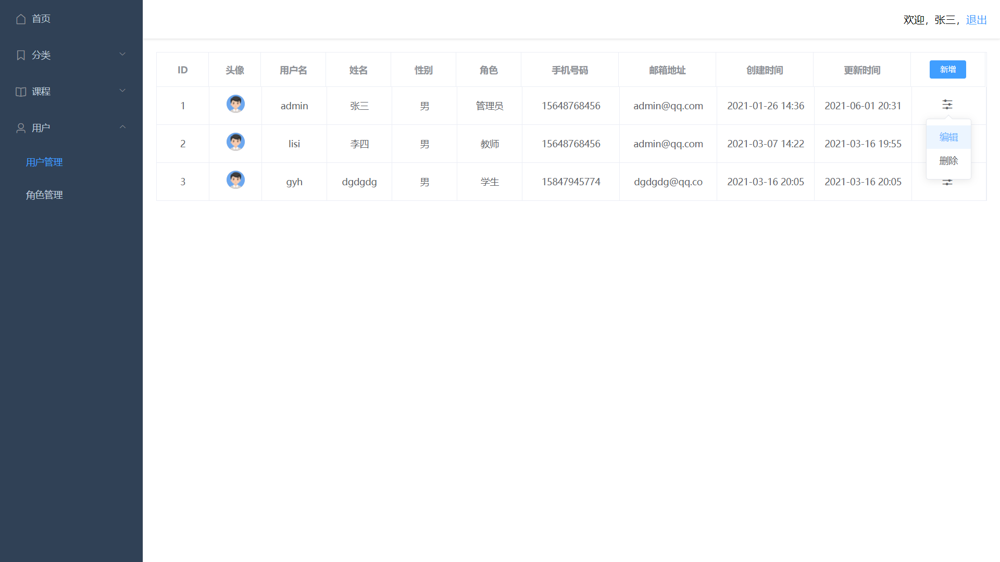

## 简介

基于 SpringCloud 和 Vue3 的 在线学习平台

## 项目地址

后端项目：[https://github.com/citrucn/Learning](https://github.com/citrucn/Learning)

后端码云地址：[https://gitee.com/citru/Learning](https://gitee.com/citru/Learning)

前端项目：[https://github.com/citrucn/Learning-Frontend](https://github.com/citrucn/Learning-Frontend)

前端码云项目：[https://gitee.com/citru/Learning-Frontend](https://gitee.com/citru/Learning-Frontend)

## 初始账号密码

账号: admin 密码: 123456

## 部署文档

[https://github.com/citrucn/Learning/wiki/document](https://github.com/citrucn/Learning/wiki/document)

## 演示截图

课程封面图片来源于慕课网，仅用于截图演示，如有侵权请联系删除

### 首页

### 课程列表

### 课程详情

### 购买课程

### 在线支付

### 查看内容

### 问题列表

### 问题详情

### 笔记列表

### 评价列表

### 搜索课程

### 教学管理

### 创建课程

### 创建章节

### 分类管理

### 课程管理

### 用户管理

